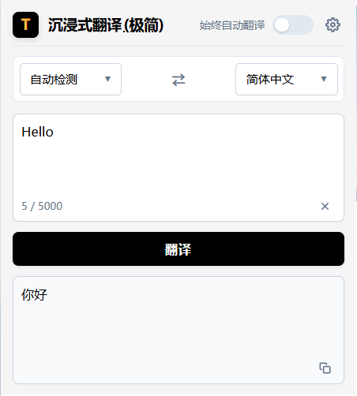
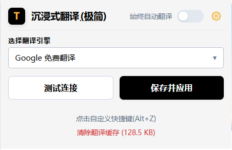
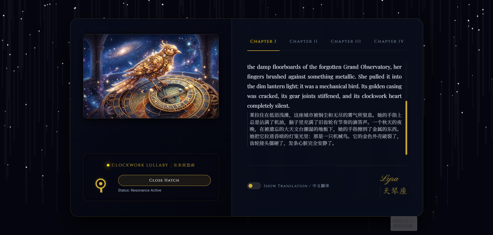

# 沉浸式翻译 (极简版)

> ⚡ **极简、高效、即装即用。** 专为 Chrome 浏览器打造的双语对照网页翻译 & 极速文本直译扩展程序。

本项目旨在保留沉浸式翻译最核心、最实用的网页双语对照阅读功能，去除繁琐臃肿的配置，追求极致的加载速度与极低的系统资源占用。在最新版本中，我们还加入了**极速文本直译首屏**，无需跳转外部网站即可快速完成段落翻译。

---

## 📸 运行界面

### 1. 插件面板

| 🔤 极速文本直译 (默认首屏) | ⚙️ 翻译引擎配置 (次级面板) |
|:---:|:---:|
|  |  |

### 2. 网页双语对照翻译效果 (支持溢出内容精致滚动)

---

## 🌟 核心特色

* ✍️ **首屏极速文本直译**：全新的默认首屏，无需跳转谷歌翻译等外部网站。采用上下对照布局，直接在输入框中录入文本并点击“翻译”按钮，即可快速获得翻译结果。
* ⚙️ **次级配置面板**：点击右上角齿轮 ⚙️ 即可平滑切换配置面板。配置完成后点击“保存并应用”，系统会在 1.2 秒后自动为您切回直译首屏，体验极佳。
* 📖 **双语对照网页翻译**：智能识别网页段落，提供优雅的原文与译文对照排版，保障流畅的阅读体验。
* ⚡ **极简轻量**：无冗余后台进程，启动迅速，内存占用极低。
* 🔑 **多翻译源支持**：支持传统免费翻译服务与现代先进大语言模型 API。
* 💾 **快捷键控制**：使用快捷键（默认 `Alt + Z`）即可一键开启或关闭当前网页的对照翻译。
* 🔄 **一键导入/导出**：支持通过点击 Logo 的“(极简)”字样，根据剪贴板自动判定进行配置的快速备份与导入，方便跨设备同步。

---

## 🛠 支持的翻译引擎

本极简版支持以下翻译服务的配置与调用：

1. **免费/内置引擎**：
   * 谷歌翻译 (Google Translate)
   * 微软翻译 (Edge Translate)
2. **需要 API Key 的高级引擎**：
   * 百度翻译 (官方 API)
   * DeepSeek API (支持自定义 host 和模型)
   * Gemini API (支持自定义 host 和模型)
   * Claude API (支持自定义 host 和模型)

---

## 🚀 安装指南

由于本插件为极简核心版，目前建议通过开发者模式进行本地加载：

1. 克隆或下载本仓库代码到本地。
2. 打开 Chrome 浏览器，访问 `chrome://extensions/`（或点击浏览器右上角三个点 -> 扩展程序 -> 管理扩展程序）。
3. 在扩展程序页面右上角开启 **“开发者模式”** 开关。
4. 点击左上角的 **“加载已解压的扩展程序”**。
5. 选择下载好的项目根目录（即包含 `manifest.json` 的文件夹）即可完成安装。

---

## 💡 使用小贴士

* **快捷键**：在任意网页按下 `Alt + Z`，即可快速对当前页面进行双语翻译。
* **快捷配置备份**：
  * **备份（导出）**：如果你的剪贴板中没有有效的配置，点击 Popup 顶部的 **“(极简)”** 字样，即可将当前的所有配置一键导出并自动复制到剪贴板。
  * **恢复（导入）**：如果你复制了导出的配置 JSON 串，再次点击 Popup 顶部的 **“(极简)”** 字样，即可实现配置的无缝导入与即时应用。

---

## 📄 开源协议

本项目基于 **[MIT License](LICENSE)** 协议开源。您可以自由地使用、修改和分发本项目的代码。
